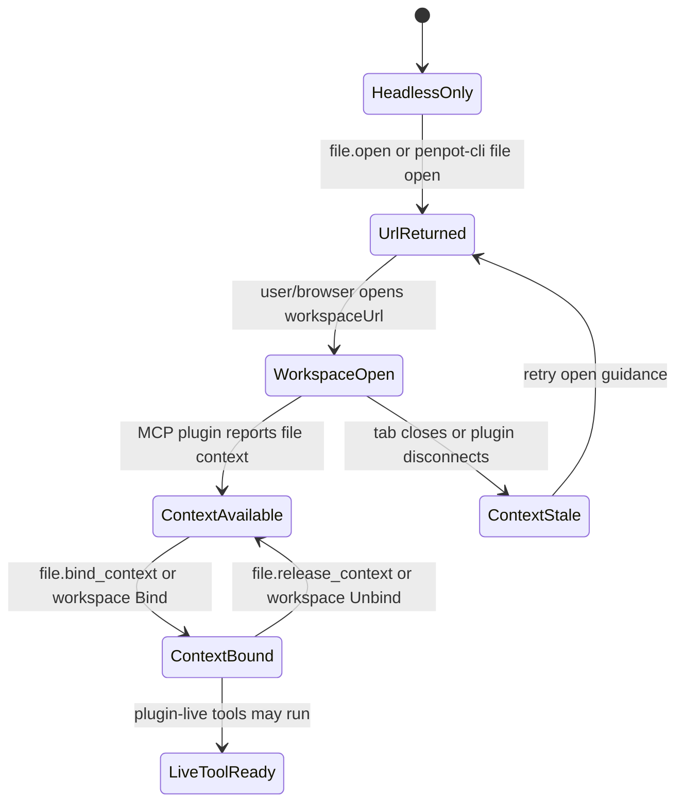

# File Open And Bind Handoff

This document defines the Phase 12 handoff contract between headless MCP/CLI
operations and the visual Penpot workspace.

P11 made many explicit file/page/object operations work without an open browser
tab. Some operations still need the live workspace because they depend on UI
state such as current page, current selection, plugin-only layout metadata, or
interactive plugin tasks. The handoff flow makes that transition predictable:
the agent can open or point the user to the correct file, wait for the workspace
plugin to report a context, bind that context, and then retry the live-only
tool.

## Current Baseline

The current implementation already has these pieces:

| Surface | Existing behavior |
| --- | --- |
| CLI `file open` | Builds a workspace URL from `--public-uri`, `--team-id`, `--page-id`, and the file id. It returns `workspaceUrl`, `handoff`, `boundContext: false`, and does not open a browser. |
| MCP `file.open` | Builds the same workspace URL and handoff payload as CLI without binding context. |
| MCP `file.get_context` | Returns token-scoped bound, available, stale, and unbound file context summaries. |
| MCP `file.bind_context` | Binds an already reported workspace context by `contextId`, by `fileId` when unique, or by no selector when only one context exists. |
| MCP `file.release_context` | Releases the bound context while keeping open contexts available. |
| Workspace menu | Lets the user connect/disconnect MCP and bind/unbind the current workspace file context. |
| Dashboard sidebar | Shows the global MCP file-context state outside the editor when MCP is enabled or a context exists. |
| Settings diagnostics | Shows connection, plugin, file context, logs, last error, refresh state, and token-expired handoff state. |

P12.4 completes the initial handoff loop: live-only error guidance now tells
both humans and agents exactly what to do when a headless command needs live
workspace state.

For the release-verification flow that exercises this handoff end to end, see
[`live-bind-smoke-flow.md`](live-bind-smoke-flow.md).

## Terms

| Term | Meaning |
| --- | --- |
| `workspaceUrl` | Browser URL for `/#/workspace?file-id=<id>` plus optional `team-id` and `page-id`. |
| `availableContext` | A plugin-reported workspace context that is open but not selected for MCP file-scoped tools. |
| `boundContext` | The one token-scoped context selected for plugin-live MCP tools. |
| `handoff` | A structured response that includes the workspace URL, target ids, context status, and next actions. |
| `live-only tool` | A tool that cannot run from backend-command or exporter for the requested operation. |

## URL Contract

All surfaces must generate the same workspace URL shape:

```text
<public-uri>/#/workspace?file-id=<file-id>[&team-id=<team-id>][&page-id=<page-id>]
```

Rules:

- `file-id` is required.
- `team-id` is optional and should be included when known from project/file
  listings.
- `page-id` is optional and should be included when the agent wants a specific
  page visible before binding.
- The URL opens or navigates the browser; it does not imply the context is
  bound.
- A future "open browser" option may invoke the OS/browser locally, but the
  returned contract must still include the URL for remote and scripted usage.

## Handoff State Machine



## User-Facing Flow

1. The agent runs a headless operation and receives an adapter error or
   `file_context_required` response for a live-only operation.
2. The response includes a `handoff` object with `workspaceUrl`, target ids,
   context status, and next actions.
3. The user opens the URL or the CLI/MCP surface opens it where local browser
   control is available.
4. The workspace MCP plugin reports an `available` context for the same token
   and file id.
5. The agent calls `file.bind_context` with `contextId` when available, or with
   `fileId` when exactly one matching context exists.
6. The live-only tool is retried. The response now reports the selected
   `boundContext`.
7. The agent calls `file.release_context` when the live-only sequence is done,
   unless the user wants the workspace to remain bound for follow-up work.

## Surface Responsibilities

| Surface | P12.1 contract | Implementation slice |
| --- | --- | --- |
| Dashboard | Shows global MCP file-context state and available/bound/stale context summary outside the editor. | Completed in P12.3 |
| Settings Integrations | Remains the configuration and diagnostics home and exposes enough handoff state to debug unbound/stale/expired-token contexts. | Completed in P12.3 |
| Workspace menu | Remains the manual connect/bind/release control for the currently open file. | Existing, polish in P12.4 if needed |
| MCP `file.open` | Returns the same `workspaceUrl` and `handoff` data as CLI, without claiming a bound context. | Completed in P12.2 |
| CLI `file open` | Keeps script-friendly text/JSON output and adds handoff next actions without depending on MCP server internals. | Completed in P12.2 |
| Live-only MCP errors | Include precise open/bind/retry actions and target-aware `handoff` data when the target file is known. | Completed in P12.4 |

## Command Contracts

### MCP `file.open`

Request:

```json
{
  "fileId": "uuid",
  "teamId": "uuid?",
  "pageId": "uuid?",
  "publicUri": "https://penpot.example?",
  "openBrowser": false
}
```

Response:

```json
{
  "status": "ok",
  "data": {
    "command": "file.open",
    "adapter": "browser-url",
    "fileId": "uuid",
    "teamId": "uuid?",
    "pageId": "uuid?",
    "workspaceUrl": "https://penpot.example/#/workspace?file-id=...",
    "boundContext": false,
    "handoff": {
      "status": "url_returned",
      "requiresUserAction": true,
      "nextActions": [
        "open_workspace_url",
        "file.get_context",
        "file.bind_context",
        "retry_original_tool"
      ],
      "target": {
        "fileId": "uuid",
        "teamId": "uuid?",
        "pageId": "uuid?"
      }
    }
  }
}
```

`openBrowser` is optional. It is only valid for local/single-user deployments
where the MCP server is allowed to control the local desktop. Remote and
multi-user deployments must return the URL and leave browser opening to the
client or user.

### CLI `file open`

CLI output includes `url`, `workspaceUrl`, `handoff`, and
`boundContext: false`.

P12.2 added:

- `workspaceUrl` as an alias for `url` in JSON output.
- `handoff.status: "url_returned"`.
- `handoff.nextActions` with open, inspect, bind, and retry steps.

`--open` remains a future option. It should only be added through an explicit
local-browser adapter and guarded by clear errors when unavailable.

The text output should stay short:

```text
Workspace URL
https://penpot.example/#/workspace?file-id=...
Open this URL, then run file.get_context and file.bind_context before live-only MCP tools.
```

### `file_context_required` Error

Live-only tools should use this shape when they cannot run:

```json
{
  "status": "error",
  "error": {
    "code": "file_context_required",
    "message": "render.preview requires a bound Penpot file context before it can run.",
    "actions": [
      "file.open",
      "file.get_context",
      "file.bind_context",
      "retry_original_tool"
    ],
    "data": {
      "fileContext": {
        "status": "available",
        "bound": false,
        "boundContext": null,
        "availableContexts": [],
        "staleContexts": [],
        "contextCount": 0
      },
      "handoff": {
        "status": "context_required",
        "workspaceUrl": "https://penpot.example/#/workspace?file-id=...",
        "requiresUserAction": true,
        "nextActions": [
          "open_workspace_url",
          "file.get_context",
          "file.bind_context",
          "retry_original_tool"
        ],
        "target": {
          "fileId": "uuid?",
          "pageId": "uuid?"
        }
      },
      "nextActions": [
        "open_workspace_url",
        "file.get_context",
        "file.bind_context",
        "retry_original_tool"
      ],
      "retryTool": "render.preview"
    }
  }
}
```

If the tool has no explicit file target and no reported available/stale context
can identify a file, the response omits the workspace URL by returning
`handoff: null`; `actions` and `nextActions` then guide the agent through
`file.list`, `file.get_recent`, `file.open`, `file.get_context`,
`file.bind_context`, and `retry_original_tool`.

When a tool call does not carry an explicit target, the server may infer the
target from the current token-scoped file-context summary in this order:
`boundContext`, first `availableContexts`, then first `staleContexts`.

## Status Mapping

| Registry status | User copy intent | Agent next action |
| --- | --- | --- |
| `unbound` | MCP is connected but no file is open or selected. | Use `file.open` when a target is known; otherwise `file.list` or `file.get_recent`. |
| `available` | A matching workspace is open but not selected for tools. | Call `file.bind_context`. |
| `bound` | File-scoped plugin-live tools can run. | Retry the original live-only command. |
| `stale` | The previous workspace context is no longer active. | Reopen `workspaceUrl`, then inspect and bind again. |
| `binding` / `releasing` | A user-initiated workspace operation is in progress. | Wait briefly, then call `file.get_context`. |

## Verification Targets

P12.2 proves:

- CLI and MCP generate identical URLs for file-only, team+file, page+file, and
  team+page+file inputs.
- `file.open` responses never claim a bound context.
- `file.open` returns handoff next actions in both text and JSON outputs.

P12.3 proves:

- Dashboard/settings can distinguish unbound, available, bound, stale, and
  token-expired states without opening the workspace menu.

P12.4 proves:

- `file_context_required` includes `file.open`, `file.get_context`,
  `file.bind_context`, and `retry_original_tool` when a target is known.
- Live-only errors include a workspace URL when the tool call or reported
  context contains enough target data.
- Unknown-target errors keep the discovery path explicit with `file.list`,
  `file.get_recent`, `file.open`, inspect, bind, and retry actions.
